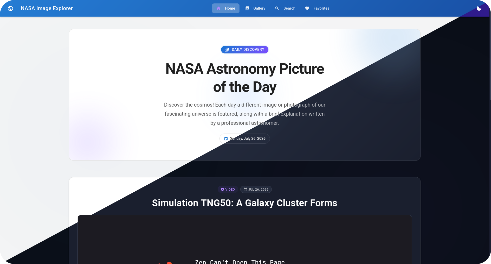
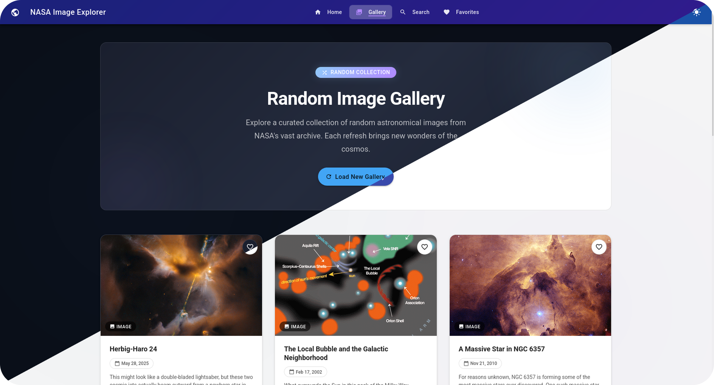
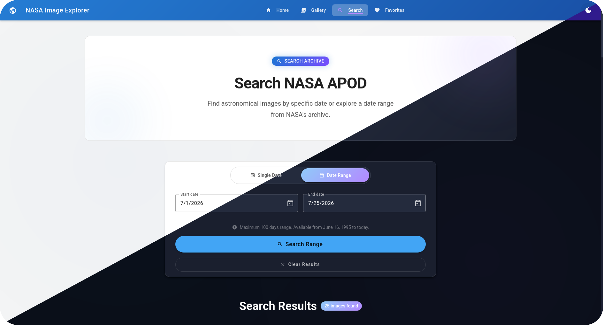
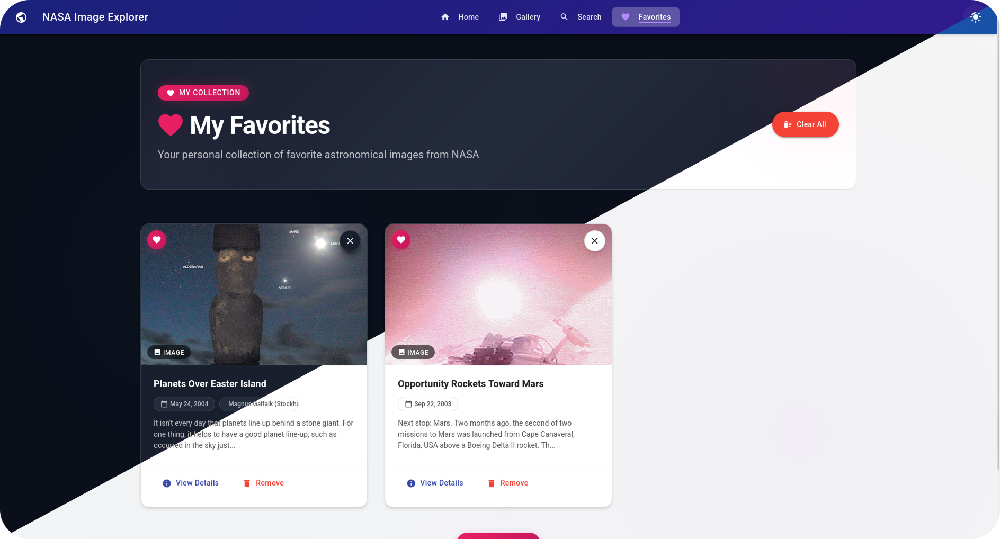
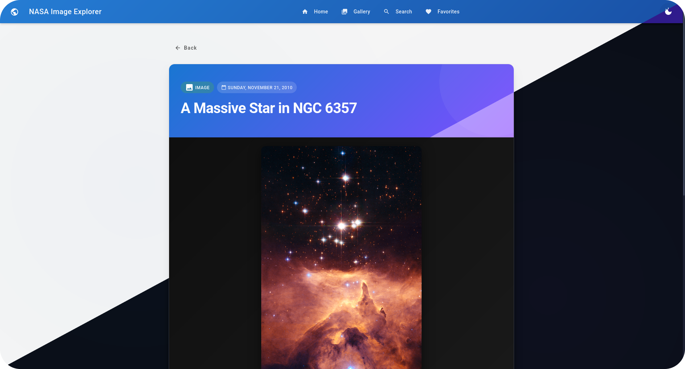
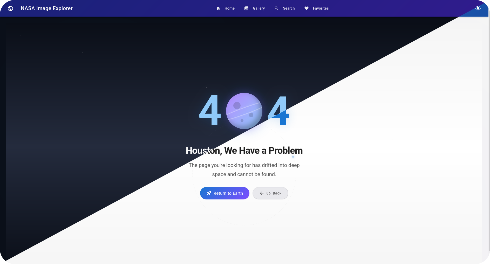

# 🚀 NASA Image Explorer

<p align="center">
  
  
  
  
</p>

<p align="center">
  <a href="https://nasa-image-explorer.pages.dev">🔗 Live Demo</a> &nbsp;|&nbsp;
  <a href="https://youtu.be/jJCwgHhxc1w?si=AUu4mnMeC0FdYitu">🎥 Video Demo</a>
</p>

<p align="center">
  Explore the cosmos through NASA's Astronomy Picture of the Day (APOD) archive.
  <br />
  Browse, search, zoom, and curate your personal collection of the universe's finest imagery.
</p>

---

## 📑 Table of Contents

- [Overview](#-overview)
- [Features](#-key-features)
- [Screenshots](#-screenshots)
- [Tech Stack](#-tech-stack)
- [Project Structure](#-project-structure)
- [Getting Started](#-getting-started)
  - [Prerequisites](#prerequisites)
  - [Installation](#installation)
  - [Environment Setup](#environment-setup)
  - [Development](#development)
  - [Production Build](#production-build)
- [Testing](#-testing)
- [Architecture](#-architecture-overview)
- [API Reference](#-api-reference)
- [Roadmap](#-roadmap)
- [Contributing](#-contributing)
- [License](#-license)
- [Acknowledgments](#-acknowledgments)
- [Author](#-author)

---

## 🌌 Overview

**NASA Image Explorer** is a modern, production-ready Angular application that brings NASA's [Astronomy Picture of the Day (APOD)](https://apod.nasa.gov/apod/astropix.html) archive to your browser. Built with Angular's latest standalone components architecture, it delivers a fast, responsive, and immersive experience for discovering and interacting with space media.

Whether you're viewing today's featured image, exploring historical entries, or managing your personal favorites, the application provides a polished interface with advanced features like fullscreen zoom/pan, intelligent HTTP caching, and server-side rendering for optimal performance.

---

## ✨ Key Features

| Feature | Description |
|---------|-------------|
| **Daily APOD** | Automatically displays the Astronomy Picture of the Day on the homepage. |
| **Media Gallery** | Browse a curated collection of APOD entries with infinite-scroll-like exploration. |
| **Date Range Search** | Search for specific APOD entries by selecting a start and end date. |
| **Favorites System** | Save and manage your favorite APODs with automatic local storage persistence. |
| **Interactive Fullscreen Viewer** | Zoom (mouse wheel, pinch, keyboard), pan (drag, arrow keys), and reset — all within a smooth modal overlay. |
| **Smart HTTP Caching** | Custom interceptor caches NASA API GET requests to minimize redundant network calls. |
| **Robust Error Handling** | Graceful handling of API errors including rate limiting (429), network failures, and server errors with user-friendly messages. |
| **Server-Side Rendering (SSR)** | Pre-rendered pages for faster initial loads and improved SEO. |
| **Fully Responsive** | Optimized layout for desktop, tablet, and mobile devices. |

---

## 📸 Screenshots

<div align="center">

<table>
  <tr>
    <td align="center">
      
      <br />
      <sub><b>Homepage — Picture of the Day</b></sub>
    </td>
    <td align="center">
      
      <br />
      <sub><b>Image Gallery</b></sub>
    </td>
  </tr>
  <tr>
    <td align="center">
      
      <br />
      <sub><b>Search by Date Range</b></sub>
    </td>
    <td align="center">
      
      <br />
      <sub><b>Personal Favorites</b></sub>
    </td>
  </tr>
  <tr>
    <td align="center">
      
      <br />
      <sub><b>Detailed Media View</b></sub>
    </td>
    <td align="center">
      
      <br />
      <sub><b>404 Invalid path</b></sub>
    </td>
  </tr>
</table>

</div>

---

## 🛠 Tech Stack

| Category | Technology |
|----------|------------|
| **Framework** | [Angular](https://angular.dev/) v21.0.0+ (Standalone Components) |
| **Language** | [TypeScript](https://www.typescriptlang.org/) v5.9.2 |
| **UI Library** | [Angular Material](https://material.angular.io/) v21.0.1+ |
| **State Management** | [RxJS](https://rxjs.dev/) v7.8.0+ (`BehaviorSubject`) |
| **Styling** | SCSS |
| **Build Tool** | Angular CLI |
| **SSR** | Angular SSR + [Express](https://expressjs.com/) v5.1.0+ |
| **Loading UI** | [ngx-skeleton-loader](https://www.npmjs.com/package/ngx-skeleton-loader) v13.0.0+ |

---

## 📁 Project Structure

```
nasa-image-explorer/
├── src/
│   ├── app/
│   │   ├── app.config.ts              # Root application configuration (standalone)
│   │   ├── app.routes.ts              # Main routing definitions
│   │   ├── components/                # Feature-specific standalone components
│   │   │   ├── favorites/             # Favorites management page
│   │   │   ├── home/                  # Daily APOD homepage
│   │   │   ├── image-detail/          # Individual APOD detail view
│   │   │   ├── image-gallery/         # Browseable media gallery
│   │   │   └── search/                # Date-range search interface
│   │   ├── core/                      # Singleton services, interceptors, models
│   │   │   ├── interceptor/
│   │   │   │   ├── cache.interceptor.ts   # HTTP GET caching
│   │   │   │   └── error.interceptor.ts   # Global error handling
│   │   │   ├── models/
│   │   │   │   └── apod.model.ts          # APOD data interface
│   │   │   └── services/
│   │   │       ├── nasa-api.service.ts    # NASA APOD API client
│   │   │       ├── favorites.service.ts   # Local storage favorites
│   │   │       ├── gallery-state.ts       # UI gallery state services
|   |   |       └── home-image-state.ts    # UI home state services
|   |   |
│   │   └── shared/                    # Reusable UI components & utilities
│   │       ├── components/
│   │       │   ├── apod-card/         # APOD display card
│   │       │   ├── apod-skeleton-card/  # Loading skeleton
│   │       │   └── image-fullscreen/  # Zoom/pan modal viewer
│   │       ├── pipes/
│   │       │   └── safe-url.pipe.ts   # URL sanitization
│   │       └── utils/
│   │           └── date.utils.ts      # Date formatting helpers
│   ├── environments/                  # Environment configurations
│   ├── public/                        # Static assets
│   ├── styles.scss                    # Global SCSS styles
│   └── main.ts                        # Application bootstrap
├── .docs/                             # Screenshots & documentation assets
├── angular.json
├── package.json
├── tsconfig.json
└── README.md
```

---

## 🚀 Getting Started

### Prerequisites

- **Node.js** — LTS version recommended ([Download](https://nodejs.org/))
- **npm** — v10.9.4 or higher (bundled with Node.js)
- **Angular CLI** — Install globally if not present:
  ```bash
  npm install -g @angular/cli
  ```

### Installation

1. **Clone the repository**
   ```bash
   git clone https://github.com/zidi-abderrahmen/nasa-image-explorer.git
   cd nasa-image-explorer
   ```

2. **Install dependencies**
   ```bash
   npm install
   ```

### Environment Setup

The application requires a NASA API key for fetching APOD data.

1. Copy the example environment file:
   ```bash
   cp src/environments/environment.example.ts src/environments/environment.local.ts
   ```

2. Open `src/environments/environment.local.ts` and replace `YOUR_NASA_API_KEY_HERE` with your actual key.

3. Obtain a free API key from [NASA API Portal](https://api.nasa.gov/).

> ⚠️ `environment.local.ts` is `.gitignore`d by default. Never commit your API key.

### Development

Start the local development server:
```bash
ng serve
```

Navigate to `http://localhost:4200/`. The app will automatically reload on file changes.

### Production Build

**Standard build:**
```bash
ng build --configuration production
```

**With Server-Side Rendering (SSR):**
```bash
npm run build
npm run serve:ssr:nasa-image-explorer
```

The SSR server will be available at `http://localhost:4000/`.

---

## 🧪 Testing

The project uses **Vitest** for unit testing.

```bash
# Run tests in watch mode (default)
npm test

# Run tests once (CI mode)
npm test -- --run
```

---

## 🏗 Architecture Overview

This project adopts Angular's **standalone components** architecture, eliminating the need for traditional `NgModule` declarations.

### Routing
Client-side routing is configured via `provideRouter` in `app.config.ts`, mapping clean URL paths to standalone feature components.

### State Management
Reactive state is managed through **RxJS `BehaviorSubject`** instances within dedicated services:
- `HomeImageState` — Homepage APOD data
- `GalleryState` — Gallery browsing state
- `FavoritesService` — User favorites with `localStorage` persistence

This lightweight pattern provides observable streams without the overhead of a global store like NgRx.

### HTTP Layer
Two global interceptors handle cross-cutting concerns:
| Interceptor | Purpose |
|-------------|---------|
| `HttpCacheInterceptor` | Caches successful GET requests for a configurable TTL, reducing API calls and improving perceived performance. |
| `errorInterceptor` | Catches HTTP errors and surfaces user-friendly messages for common scenarios (network failure, rate limiting, server errors). |

### Shared Components
The `src/app/shared` directory houses reusable, framework-agnostic UI primitives:
- **`ApodCard`** — Consistent media card used across gallery, favorites, and search results
- **`ApodSkeletonCard`** — Loading placeholder matching the card layout
- **`ImageFullscreen`** — Advanced modal with DOM-based zoom/pan via mouse, touch, and keyboard events

---

## 🔌 API Reference

The application consumes the **[NASA APOD API](https://api.nasa.gov/)**.

| Endpoint | Method | Description |
|----------|--------|-------------|
| `/planetary/apod` | `GET` | Fetch one or more APOD entries by date or date range |

**Required Parameters:**
- `api_key` — Your NASA API key

**Optional Parameters:**
- `date` — Specific date (`YYYY-MM-DD`)
- `start_date` / `end_date` — Date range for batch fetching
- `count` — Number of random entries to return
- `thumbs` — Return thumbnail URL for video media

---

## 🗺 Roadmap

- [x] Add infinite scroll to the gallery
- [x] Implement dark/light theme toggle
- [x] Add sharing link for individual APODs
- [x] Support for NASA Image and Video Library (IVL) integration

---

## 🤝 Contributing

Contributions are welcome! Please follow these steps:

1. Fork the repository
2. Create a feature branch (`git checkout -b feature/amazing-feature`)
3. Commit your changes (`git commit -m 'Add amazing feature'`)
4. Push to the branch (`git push origin feature/amazing-feature`)
5. Open a Pull Request

Please ensure your code passes existing tests and follows the project's coding style.

---

## 📄 License

This project is licensed under the **MIT License** — see the [LICENSE](./LICENSE) file for details.

---

## 🙏 Acknowledgments

- [NASA APOD API](https://api.nasa.gov/) for providing the imagery and metadata
- [Angular Team](https://angular.dev/) for the outstanding framework
- [Cloudflare Pages](https://pages.cloudflare.com/) for hosting the live demo

---

## 👤 Author

**Abdo** — *Zidi Abderrahmen*

- 💼 [LinkedIn](https://www.linkedin.com/in/zidi-abderrahmen)
- 🌐 [Portfolio](https://zidi-abderrahmen.github.io/my-portfolio-v2/)

---

<p align="center">
  Made with ❤️ and a lot of ☕
  <br />
  <sub>Keep looking up.</sub>
</p>
